<!DOCTYPE html>
<html lang="en">
<head>
    <meta charset="UTF-8">
    <meta name="viewport" content="width=device-width, initial-scale=1.0">
    <title>Game Press Kit</title>
    
</head>
<body>
    <header>
        <h1>Thrack-The-Fox Press Kit</h1>
    </header>
    

        

            <h2>About The Fox</h2>
            
"Thrack The Fox" is an upcoming 3D open-world adventure game developed collaboratively by TPSG (TrentPattersonStudioGaming) and Godway Games. Players will control Thrack, an anthropomorphic fox equipped with a sword, hammer, and bow, embarking on a quest for treasure in a vibrant, chaotic world. The game features a variety of unhinged characters, including dragons, parrots, dogs, lions, and beavers, each contributing to the game's rich narrative. While our protaganist finds himself in a world that's gone mad for treasure.

        

		

			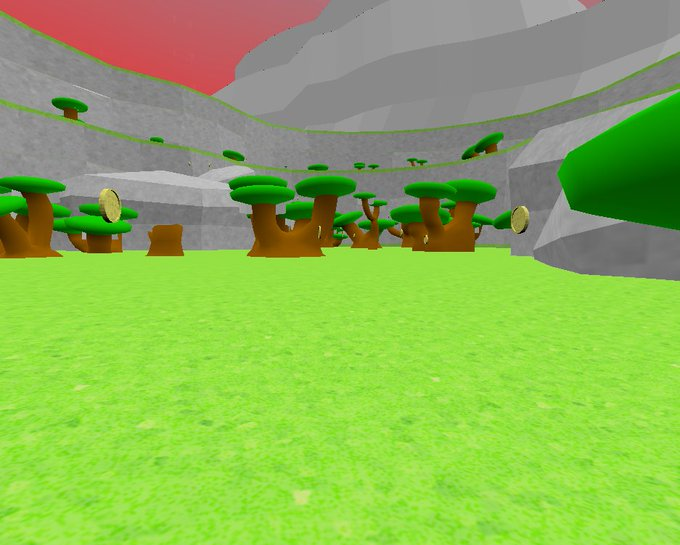
			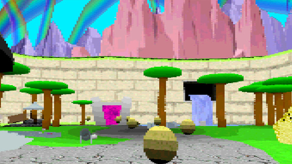
			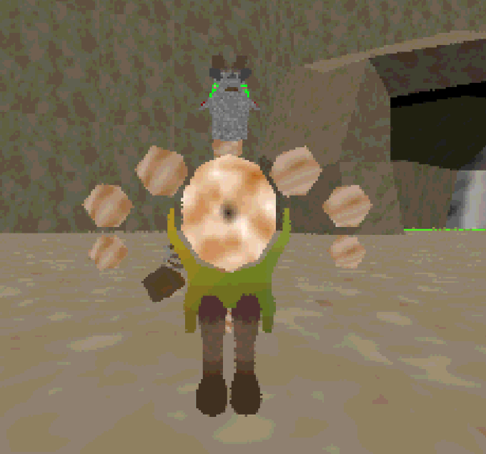
			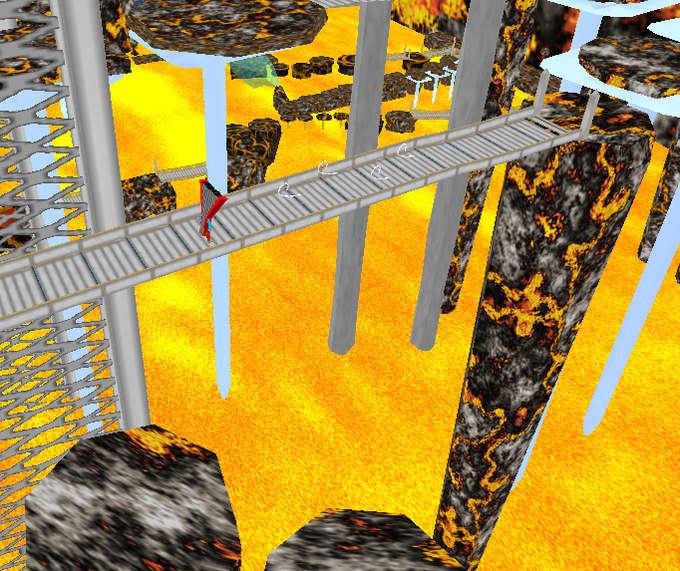
			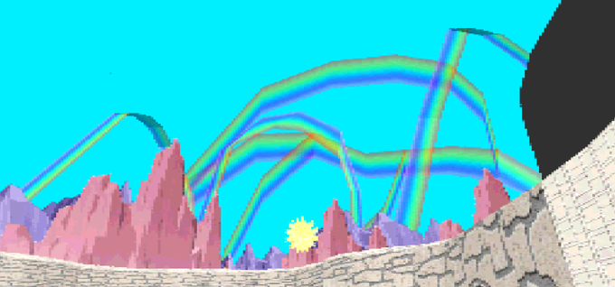
			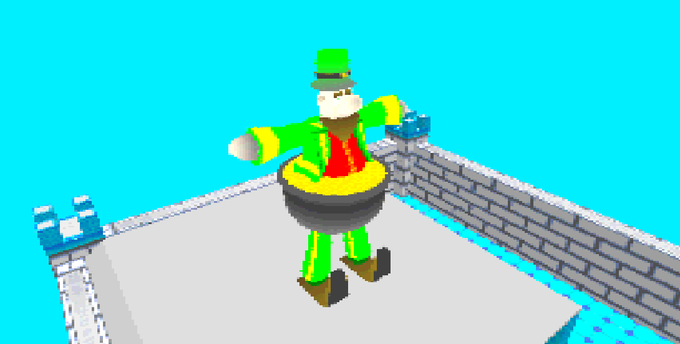
			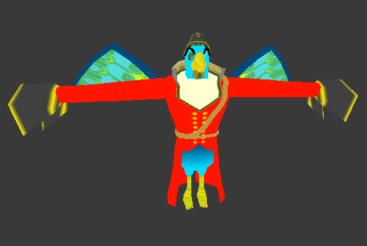
			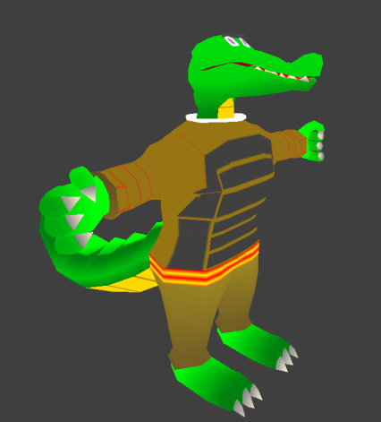
			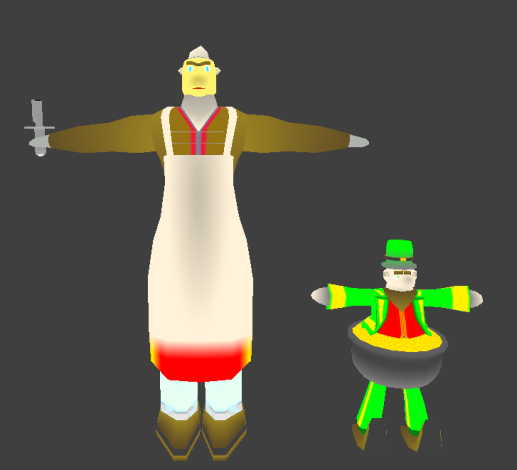
			
			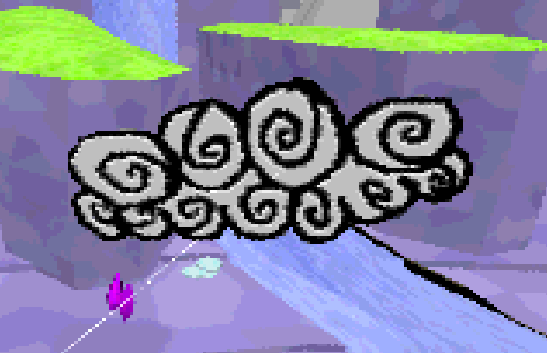
			
			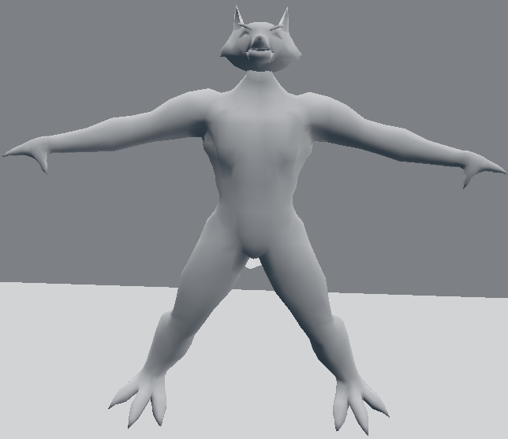
			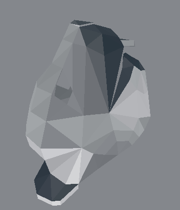
			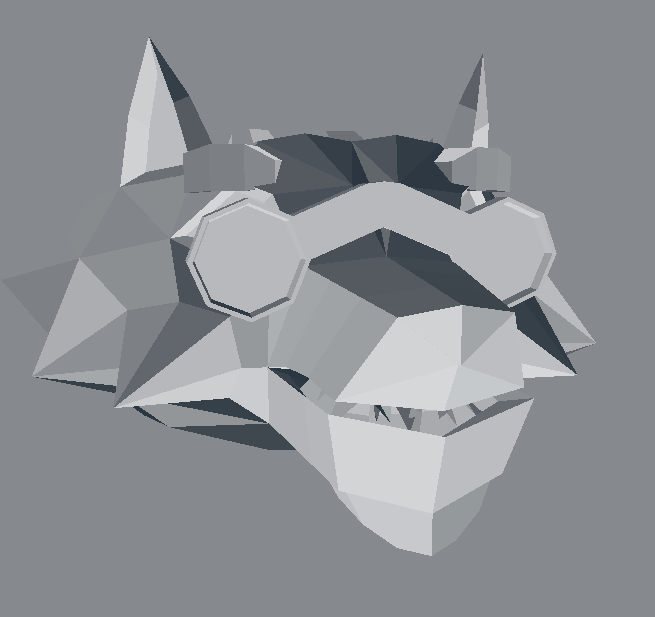
			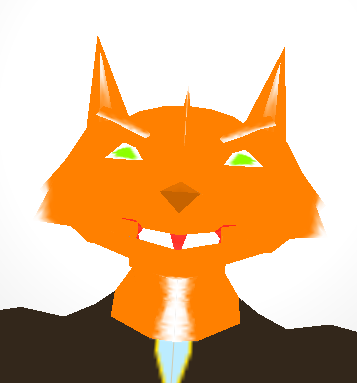			
					
		

		
				
		
        

			<h3>Test Reels</h3>
			

				

					<video autoplay loop muted>
						<source src="ConvertThrackSPrint.mp4" type="video/mp4">
						Your browser does not support the video tag.
					</video>
				

				

					<video autoplay loop muted>
						<source src="CRABBOKI.mp4" type="video/mp4">
						Your browser does not support the video tag.
					</video>
				

				

					<video autoplay loop muted>
						<source src="crumplersphere.mp4" type="video/mp4">
						Your browser does not support the video tag.
					</video>
				

				

					<video autoplay loop muted>
						<source src="DYNAMICINVENTORY.mp4" type="video/mp4">
						Your browser does not support the video tag.
					</video>
				

				

					<video autoplay loop muted>
						<source src="FlowersTest01.mp4" type="video/mp4">
						Your browser does not support the video tag.
					</video>
				
	
				

					<video autoplay loop muted>
						<source src="GWAYENDBOSSTHRACK.mp4" type="video/mp4">
						Your browser does not support the video tag.
					</video>
				
			
				

					<video autoplay loop muted>
						<source src="PauseTestThrack.mp4" type="video/mp4">
						Your browser does not support the video tag.
					</video>
				
						
				

					<video autoplay loop muted>
						<source src="scastle.mp4" type="video/mp4">
						Your browser does not support the video tag.
					</video>
				
										
				

					<video autoplay loop muted>
						<source src="SceneTransitioningTestThrack.mp4" type="video/mp4">
						Your browser does not support the video tag.
					</video>
				
		
				

					<video autoplay loop muted>
						<source src="ScrollCamMenu.mp4" type="video/mp4">
						Your browser does not support the video tag.
					</video>
				
		
				

					<video autoplay loop muted>
						<source src="SkeletonAdGodway.mp4" type="video/mp4">
						Your browser does not support the video tag.
					</video>
				
					
				

					<video autoplay loop muted>
						<source src="thrackbutcherfilm.mp4" type="video/mp4">
						Your browser does not support the video tag.
					</video>
				
						
			

        

		
		<h3>Demo Music Samples</h3>
		

			<video id="music-video" class="custom-video">
				<source src="ThrackMusicShowOff.mp4" type="video/mp4">
				Your browser does not support the video tag.
			</video>
		
	
			

				<button id="play-pause" class="play-pause-btn">Play</button>
				<input type="range" id="time-bar" class="time-bar" value="0" step="1" min="0">
				

					<button id="mute-btn" class="mute-btn">Mute</button>
					<input type="range" id="volume-bar" class="volume-bar" value="100" min="0" max="100">
				

			

		
				

		
        

            <h2>Key Features</h2>
            <ul>
                <li><strong><h4>Dynamic Stylized Day-Night Cycle</strong></h4></li>
				

				
<strong>Experience the world change in real-time with a dynamic day-night cycle, time affects gameplay, puzzles, and player choice.</strong>

				

                <li><strong><h4>Play as Thrack</strong></h4></li>
				

				
<strong>Embark on an epic adventure as Thrack, a large and well meaning but relatively unintelligent anthropomorphic fox with and a range of combat abilities, including swordplay, hammer strikes, and archery.</strong>

				

                <li><strong><h4>Open-World Exploration</strong></h4></li>
				

				
<strong>Roam freely across a vibrant, chaotic and creative world of highly accentuated eccentric characters.</strong>

				
			
                <li><strong><h4>Modding Support</strong></h4></li>
				

				
<strong>Thrack the Fox includes a fully integrated Modding API, allowing players to interact with the game's assets directly from the console.   It also allows mod-creators to upload share their own content directly within the game.</strong>

				

                <li><strong><h4>PlayStation 1-Style Graphics</strong></h4></li>
				

				
<strong>Enjoy a nostalgic, retro-inspired art style that evokes the feel of 90s-era games, as well as guarunteeing that mid-range systems will be able to render its gameplay.</strong>

				
				
                <li><strong><h4>Combination of Choreographed and dynamic Combat</strong></h4></li>
				

				
<strong>In Thrack The Fox combat is Choreographically animated to the game level itself so that enemies can interact seamlessly with eachother, while also providing a break from these patterns through more old fashioned means of dynamic ai.   In Thrack The Fox every enemy is at the technical level an individual rather than being copy pasted onto the level as we've come to expect from most titles. It is in this way that we hope to provide a dynamic puzzler style combat experience.</strong>

				
								
                <li><strong><h4>Portal To Unique Worlds From Hubs</strong></h4></li>
				

				
<strong>Thrack contains many worlds which can be portaled too from the primary world giving the environment a fantastical near-psychodelic atmosphere and feeling.</strong>

				
												
            </ul>
        

		
		

<head>
    <meta charset="UTF-8">
    <meta name="viewport" content="width=device-width, initial-scale=1.0">
    <title>Popup with URLs</title>
    
	

  

	
</head>

		
		
        

            <h2>Download Assets</h2>
            <a href="press-assets.zip" class="btn">Download Press Kit</a><!--&nbsp; <a href="press-assets.zip" class="btn">Download Press Kit</a>-->
&nbsp; 
    

        

            
        
Demo Disc
 <!-- Text on the button -->
        

        
X

    

        

Public Demo Not Yet Available

		
	

	<h2>Progress</h2>
	<button class="btn" onclick="openPopup()">Progression Timeline</button>	<button class="btn" onclick="openPopup2()">General Timeline</button>
	
		

  <!-- The Popup -->
  

    

      &times;
      <!-- Embedding another webpage in the popup -->
      <iframe src="Progress.html" width="100%" height="400px" style="border: none;"></iframe>
    

  

  
  <!-- The Popup -->
  

    

      &times;
      <!-- Embedding another webpage in the popup -->
      <iframe src="Timeline.html" width="100%" height="400px" style="border: none;"></iframe>
    

  
  

  
		
        

            <h2>Social Handles & Specialty Urls</h2>
            <!--
For inquiries, please contact: <a href="mailto:your-email@example.com">your-email@example.com</a>
-->
        

    <!-- Button to trigger popup -->
    <button class="btn" id="showPopupBtn" onclick="openPopup3()">Show URLs</button>

    <!-- Popup Box -->
<!--    

<!--        

<!--            <!--&times;-->
<!--            <h2>Here are some useful URLs:</h2>
<!--            <ul>
<!--                <li><a href="https://www.example.com" target="_blank">Example 1</a></li>
                <li><a href="https://www.example2.com" target="_blank">Example 2</a></li>
                <li><a href="https://www.example3.com" target="_blank">Example 3</a></li>
            </ul>
        

    
-->

  <!-- The Popup -->
  

    

      &times;
      <!-- Embedding another webpage in the popup -->
      <iframe src="MediaHandles.html" width="100%" height="400px" style="border: none;"></iframe>
    

  
  
	
    
    

</body>
</html>
